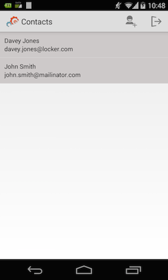
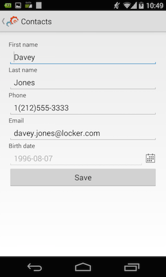
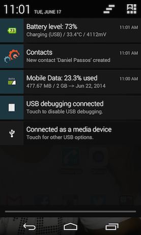

push-contacts-mobile-android: Push Contacts Mobile Android
===========================
Author: Daniel Passos (dpassos)  
Level: Intermediate  
Technologies: Java, Android  
Summary: A contacts CRUD mobile application with push notification integration.  
Target Product: Unified Push  
Versions: 1.0  
Source: <https://github.com/jboss-developer/jboss-mobile-quickstarts/>  

## What is it?

This quickstart demonstrates how to develop more advanced Android push applications, centered around a CRUD contacts application.

This client-side Android project must be used in conjunction with the `push-contacts-mobile/server/push-contacts-mobile-picketlink-secured` application, which provide the accompanying server-side functionality. 

When the client application is deployed to an Android device, the push functionality enables the device to register with the running JBoss Unified Push Server instance and receive push notifications. The server-side application provides login authentication for the client application and sends push notification requests to the Unified Push Server in response to new contacts being created. Push notifications received by the Android device contain details of newly added contacts.

## How do I run it?

###0. System requirements
* [Java 7](http://www.oracle.com/technetwork/java/javase/downloads/index.html)
* [Maven 3.1.1](http://maven.apache.org)
* Latest [Android SDK](https://developer.android.com/sdk/index.html) and [Platform version 19](http://developer.android.com/tools/revisions/platforms.html)
* Latest [Android Support Library](http://developer.android.com/tools/support-library/index.html) and [Google Play Services](http://developer.android.com/google/play-services/index.html)

###1. Prepare Maven Libraries
This quickstart is designed to be built with Maven. It requires the JBoss Unified Push Maven repository and Google libraries.

You must have the JBoss Unified Push Maven repository available and Maven configured to use it. For more information, see the [JBoss Unified Push documentation](https://access.redhat.com/documentation/en-US/Red_Hat_JBoss_Unified_Push/) or the README distributed with the JBoss Unified Push Maven repository.

Google does not ship all the required libraries to Maven Central so you must deploy them locally with the helper utility [maven-android-sdk-deployer](https://github.com/mosabua/maven-android-sdk-deployer) as detailed here.

1. Checkout maven-android-sdk-deployer
```shell
$ git clone git://github.com/mosabua/maven-android-sdk-deployer.git
```
2. Set up the environment variable `ANDROID_HOME` to contain the Android SDK path
3. Install Maven version of Android platform 19
```shell
$ cd /path/to/maven-android-sdk-deployer/platforms/android-19
$ mvn install -N
```
4. Install Maven version of google-play-services
```shell
$ cd /path/to/maven-android-sdk-deployer/extras/google-play-services
$ mvn install -N
```
5. Install Maven version of compatibility-v4
```shell
$ cd /path/to/maven-android-sdk-deployer/extras/compatibility-v4
$ mvn install -N
```
6. Install Maven version of compatibility-v7-appcompat
```shell
$ cd /path/to/maven-android-sdk-deployer/extras/compatibility-v7-appcompat
$ mvn install -N
```

###2. Register Application with Push Services
First, you must register the application with Google Cloud Messaging for Android and enable access to the Google Cloud Messaging for Android APIs and Google APIs. This ensures access to the APIs by the Unified Push Server when it routes push notification requests from the application to the GCM. Registering an application with GCM requires that you have a Google account.

1. Log into the [Google Cloud Console](https://console.developers.google.com)
2. In the `Projects` view, click `Create Project`.
3. In the `PROJECT NAME` field type a project name, select the check box to agree to the Terms of Service and click `Create`.
4. Reload the page and in the `Projects` view click the project you just created. Make note of the `Project Number`.
5. Click `APIs and auth`>`APIs` and change the status of `Google Cloud Messaging for Android` to `ON`.
6. Click `APIs and auth`>`Credentials` and under `Public API access` click `Create new Key`.
7. Click `Server Key` and click `Create`. Make note of the `API KEY`.

Second, you must register the application and an Android variant of the application with the Unified Push Server. This requires a running Unified Push Server instance and uses the unique metadata assigned to the application by GCM. For information on installing the Unified Push Server, see the README distributed with the Unified Push Server or the [JBoss Unified Push documentation](https://access.redhat.com/documentation/en-US/Red_Hat_JBoss_Unified_Push/).

1. Log into the Unified Push Server console.
2. In the `Applications` view, click `Create Application`.
3. In the `Name` and `Description` fields, type values for the application and click `Create`.
4. When created, under the application click `No variants`.
5. Click `Add Variant`.
6. In the `Name` and `Description` fields, type values for the Android application variant.
7. Click `Android` and in the `Google Cloud Messaging Key` and `Project Number` fields type the values assigned to the project by GCM.
8. Click `Add`.
9. When created, expand the variant name and make note of the `Server URL`, `Variant ID`, and `Secret`.

###3. Customize and Build Application
The project source code must be customized with the unique metadata assigned to the application variant by the Unified Push Server and GCM. 

1. Open `QUICKSTART_HOME/push-contacts-mobile/client/push-contacts-mobile-android/src/org/jboss/aerogear/unifiedpush/quickstart/Constants.java` for editing.
2. Enter the application variant values allocated by the Unified Push Server and GCM for the following constants:
```java
String UNIFIED_PUSH_URL = "";
String VARIANT_ID = "";
String SECRET = "";
String GCM_SENDER_ID = "";
```
3. Save the file.
4. Build the application
```shell
$ cd QUICKSTART_HOME/push-contacts-mobile/client/push-contacts-mobile-android
$ mvn compile
```

###4. Test Application

####0. Prerequisites
1. The Unified Push Server must be running before the application is deployed to ensure that the device successfully registers with the Unified Push Server on application deployment.
2. The `push-contacts-mobile/server/push-contacts-mobile-picketlink-secured` application must be running before attempting to log into the mobile client application to ensure successful login. For more information, see the README distributed with the `push-contacts-mobile-picketlink-secured` application.

####1. Deploy for Testing
The application can be tested on physical Android devices only; push notifications are not available for Android emulators. To deploy, run and debug the application on an Android device attached to your system, on the command line enter the following:
```shell
$ cd QUICKSTART_HOME/push-contacts-mobile/client/push-contacts-mobile-android
$ mvn clean package android:deploy android:run
```

Application output is displayed in the command line window.

####2. Log In
When the application is deployed to an Android device, you can log into it and begin using the CRUD functionality. Note that access to the application is restricted to users registered with the server-side application and to assist you in getting started a number of default users are preconfigured.

1. Launch the application on the Android device.
2. Log into the application using one of the default user credentials ('_maria:maria_','_dan:dan_', or '_john:john_').

	After successful login, you are presented with a list of existing Contacts residing on the server.

	

3. Click a contact to open the Edit screen where you can modify the contact's details.

	

####3. Send a Push Message
You can send a push notification to your device by creating a new Contact.  
You can also send a push notification to your device using the `push-contacts-mobile/client/contacts-mobile-webapp` application by completing the following steps (for more information, see the README distributed with the `contacts-mobile-webapp` application):

1. Open the web interface of the `push-contacts-mobile/client/contacts-mobile-webapp` application in a browser at the following URL: <http://localhost:8080/jboss-contacts-mobile-webapp/> .
2. Add a new Contact.

This automatically triggers a push notification request to the Unified Push Server and subsequently the push notification displays on the mobile device.



