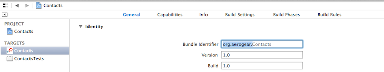
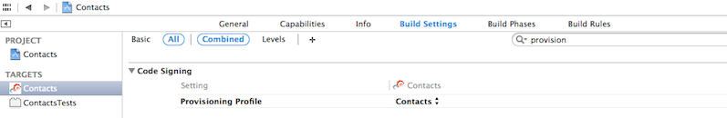
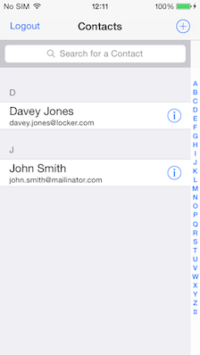
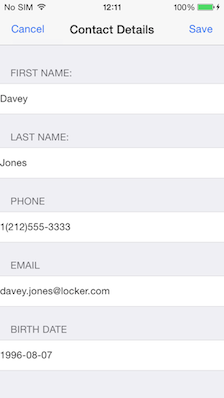

push-contacts-mobile-ios: Push Contacts Mobile iOS
===========================
Author: Christos Vasilakis (cvasilak)  
Level: Intermediate  
Technologies: Objective-C, iOS  
Summary: A contacts CRUD mobile application with push notification integration.  
Target Product: JBoss Unified Push   
Versions: 1.0   
Source: <https://github.com/jboss-developer/jboss-mobile-quickstarts/>  

## What is it?

This quickstart demonstrates how to develop more advanced iOS push applications, centered around a CRUD contacts application.

This client-side iOS project must be used in conjunction with the `push-contacts-mobile/server/push-contacts-mobile-picketlink-secured` application, which provide the accompanying server-side functionality. 

When the client application is deployed to an iOS device, the push functionality enables the device to register with the running JBoss Unified Push Server instance and receive push notifications. The server-side application provides login authentication for the client application and sends push notification requests to the Unified Push Server in response to new contacts being created. Push notifications received by the iOS device contain details of newly added contacts.

## How do I run it?

### 0. System requirements

* iOS 7.X
* Xcode version 5.1.X

### 1. Configuration

#### Creation of Certificate Signing Request and SSL certificate for APNs

First you need to submit a request for a new digital certificate, which is based on a public/private key. The Certificate itself is acting as the public key, and when you request it, a private key is added to your `KeyChain` tool. The Cerficate will be used later on, to request an SSL certificate for the `Apple Push Network Service`, which will allow the JBoss Unified Push Server to send notification messages to it.

1. Request a new CSR (Certificate Signing Request) using `KeyChain Access` tool found in `Applications > Utilities` folder on your Mac.  Once opened, in the `KeyChain Access` menu, choose `Certificate Assistant > Request a Certificate from a Certificate Authority`. Make sure that you have choosen to store the CSR _on file_, so we can upload it later in the provisioning portal when requesting the actual SSL cert.
2. Go to the [Provisioning Portal](https://developer.apple.com/account/overview.action) and log in with your Apple developer account. Now, click on the `Identifiers` link in order to create a new `App ID` (use the `PLUS` Icon on the right). In the formular give the `App ID` a descriptive name. Double check that the `Push Notifications` checkbox is _selected_.
3. Later in the same page you are asked for an `Explicit App ID`, since the generic `Wildcard App ID` does not work with Push Notifications. In the `Bundle ID` field enter _YOUR_ `Bundle ID`. This is similar to Java packages. **NOTE:** The `Bundle ID` has to match the one from the actual iOS application that you are building later in this guide.
4. In the next screen confirm your new `App ID`, and double check that the `Push Notifications` option is _enabled_. Afterwards click the `Submit` button. In the next screen, click on on the newly created `App ID`, then click the `Edit` button and scroll down to the `Push Notifications` section. Here we are asked to generate a `Development` and a `Production` certificate that will be used by the Unified Push Server when contacting the Apple Push Notification service to send messages. If you plan to distribute your app in the App Store, you are required to generate a Production certificate. 
  *  `Development Certificate`: Click the `Create Certificate` button on the `Development SSL Certificate` section. Upload the `Certificate Signing Request` that you created earlier and click the `Generate` button. The `Development SSL Certificate` file is being downloaded as `aps_development.cer`. 
  *  `Production Certificate`: Click the `Create Certificate` button on the `Production SSL Certificate` section. Upload the `Certificate Signing Request` that you created earlier and click the `Generate` button. The `Production SSL Certificate` file is being downloaded as `aps_production.cer`.
  
  You have to export this certificates/private keys pair to the .p12 (Personal Information Exchange). These files will be uploaded later on to the JBoss Unified Push Server enabling it to authorize themselves for your development application on Apple Push Network Service and send messages to them. When exporting the files, as your private keys, you need to assign a passphrase for them. Make note of them, because later when uploading them to the JBoss Unified Push Server you will need both the exported files (`aps_development.cer`, `aps_production.cer`) and the passphrases.

#### Creation of a Provisioning Profile

In order to test Push Notifications you neeed to create a _Provisioning Profile_.
  *  `Development Provisioning Profile`: In the _Provisioning Portal_ you need to create an _iOS App Development_ provisioning profile, so that you can test the Push Notifications on your own iOS devices. Select the `App ID` that you created earlier and your _Developer Certificate_. Select a _Test_ Device, give it a Profile Name and generate it. Now download the Profile and open the file. Go to `Xcode -> preferences...` menu, select the `Account` tab, on the right bottom corner click `View details...` and you should see your provisioning profile.
  *  `Distribution Provisioning Profile`: In order to test Push Notifications on a `production environment`, you need to create an _iOS App Distribution_ provisioning profile in the _Provisioning Portal_. Select the `App ID`, that you created earlier and your _Production Certificate_. You still need a _test device_ to try your _production_ app with your _distribution provisioning profile_. Select a _Test_ Device, give it a Profile Name and generate it. Now download the Profile and open the file. Go to `Xcode -> preferences...` menu, select the `Account` tab, on the right bottom corner click `View details...` and you should see your provisioning profile.
  
### 2. Register Application with Push Services

You must register the application and an iOS variant of the application with the Unified Push Server. This requires a running Unified Push Server instance and uses the unique metadata assigned to the application by APNS. For information on installing the Unified Push Server, see the [JBoss Unified Push documentation](https://access.redhat.com/documentation/en-US/Red_Hat_JBoss_Unified_Push/).

1. Log into the Unified Push Server console.
2. In the `Applications` view, click `Create Application`.
3. In the `Name` and `Description` fields, type values for the application and click `Create`.
4. When created, under the application click `No variants`.
5. Click `Add Variant`.
6. In the `Name` and `Description` fields, type values for the iOS application variant.
7. Click `iOS` and type the values assigned to the project by APNS (you will have to upload your Developer or Production Certificate)
8. Click `Add`.
9. When created, expand the variant name and make note of the `Server URL`, `Variant ID`, and `Secret`.

### 3. Customize and Build Application

Replace the bundleId with your bundleId (the one associated with your certificate).
Click on the `Contacts target -> General` and modify the _Bundle Identifier_:

Ensure the Apple _Provisioning profile_ is correctly set:

  
The project source code must be customized with the unique metadata assigned to the application variant by the Unified Push Server and APNS.  

1. Open `QUICKSTART_HOME/push-contacts-mobile/client/push-contacts-mobile-ios/Contacts/Controllers/AGLoginViewController.m` for editing.
2. Modify the URL, variant and secret to match the values allocated by the Unified Push Server and APNS for the following constants:

        AGDeviceRegistration *registration = [[AGDeviceRegistration alloc] initWithServerURL:[NSURL URLWithString:@"<# URL of the running Unified Push Server #>"]];
        ...
        [clientInfo setVariantID:@"<# Variant Id #>"];
        [clientInfo setVariantSecret:@"<# Variant Secret #>"];

   **Note 1:** You can also copy/paste these settings from your Unified Push Server console  
   **Note 2:** When changing the value of `<# URL of the running Unified Push Server #>`, use `ip` or `hostname` and not `localhost` for the `host` value (e.g. `<http(s)//host:port/context>` )
3. Save the file.
4. Open `QUICKSTART_HOME/push-contacts-mobile/client/push-contacts-mobile-ios/Contacts/Networking/AGContactsNetworker.m` for editing.
5. Modify the URL to match the path to the Contacts server backend:

        static NSString * const kAPIBaseURLString = @"<# URL of the Contacts application backend #>";

6. Save the file.
7. Build the application

### 4. Test the Application

#### 0. Prerequisites

1. The Unified Push Server must be running before the application is deployed to ensure that the device successfully registers with the Unified Push Server on application deployment.
2. The `push-contacts-mobile/server/push-contacts-mobile-picketlink-secured` application must be running before attempting to log into the mobile client application to ensure successful login. For more information, see the README distributed with the `push-contacts-mobile-picketlink-secured` application.

#### 1. Deploy for Testing

The application can be tested on physical iOS devices only; push notifications are not available for iOS simulators. 

#### 2. Log In

When the application is deployed to an iOS device, you can log into it and begin using the CRUD functionality. Note that access to the application is restricted to users registered with the server-side application and to assist you in getting started a number of default users are preconfigured.

1. Launch the application on the iOS device.
2. Log into the application using one of the default user credentials ('_maria:maria_','_dan:dan_', or '_john:john_').

	After successful login, you are presented with a list of existing Contacts residing on the server.

    

3. Click a contact to open the Edit screen where you can modify the contact's details.

    

#### 3. Send a Push Message

You can send a push notification to your device by creating a new Contact.  
You can also send a push notification to your device using the `push-contacts-mobile/client/contacts-mobile-webapp` application by completing the following steps (for more information, see the README distributed with the `contacts-mobile-webapp` application):

1. Open the web interface of the `push-contacts-mobile/client/contacts-mobile-webapp` application in a browser at the following URL: <http://localhost:8080/jboss-contacts-mobile-webapp/> .
2. Add a new Contact.

This automatically triggers a push notification request to the Unified Push Server and subsequently the push notification displays on the mobile device.

## 'Content-Available'

Instead of the regular `didReceiveRemoteNotification` callback invoked when a new notification is received, the application utilizes the 'silent' push feature (offered by iOS 7 and later), so the application can be instructed to fetch the new content even if background (and possible suspended). Thus when the user opens up the app, the content is already available to be viewed. Take a look at the `didReceiveRemoteNotification` notification callback method inside the file `QUICKSTART_HOME/push-contacts-mobile/client/push-contacts-mobile-ios/Contacts/AGAppDelegate.m` for the implementation details.

        - (void)application:(UIApplication *)application didReceiveRemoteNotification:(NSDictionary *)userInfo fetchCompletionHandler:(void (^)(UIBackgroundFetchResult))completionHandler {
        - ...
        }

FAQ
---
* Which iOS version is supported by JBoss Unified Push CRUD mobile app?

   JBoss Unified Push supports iOS 7.0 and later.

Debug the Application
=====================

Set a break point in Xcode.

